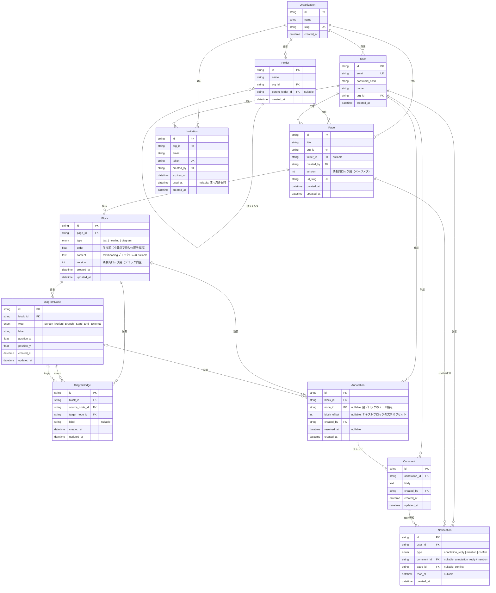

# logi-canvus ER図

## 補足

### Block.type
| 値 | 説明 |
|----|------|
| `text` | リッチテキストブロック |
| `heading` | 見出しブロック（H1/H2/H3） |
| `diagram` | 図ブロック（React Flow キャンバス） |

### Block.order
float 型で管理する。ブロック間への挿入時は前後の order の中間値を使用し、精度が尽きた場合は全ブロックを rebalance する。

### Block.version / Page.version
楽観的ロックの粒度を分離する。

| フィールド | 競合検出対象 |
|-----------|------------|
| `Page.version` | ページタイトル等のメタ情報 |
| `Block.version` | 各ブロックの内容 |

これにより別々のブロックを同時編集した場合に不要な競合が発生しない。

### DiagramNode.type
| 値 | 説明 |
|----|------|
| `Screen` | 画面・ページ |
| `Action` | 処理・操作 |
| `Branch` | 条件分岐（if/else） |
| `Start` | フローの起点 |
| `End` | フローの終点 |
| `External` | 外部システム・API |

### Notification.type と参照先FK
ポリモーフィック参照（`ref_id` 単一カラム）を廃止し、型ごとに明示的な FK カラムで管理する。

| type | 使用カラム | 意味 |
|------|-----------|------|
| `annotation_reply` | `comment_id` | 返信されたコメント |
| `mention` | `comment_id` | メンションを含むコメント |
| `conflict` | `page_id` | 競合が発生したページ |

### Annotation.block_offset
テキストブロックへのピン位置を文字オフセット（整数）で保持。図ブロックのノードに対するピンは `node_id` で管理するため `block_offset` は不要（nullable）。

### Invitation
招待トークンを管理するテーブル。`used_at` が null でなければ使用済み。`expires_at` を過ぎたトークンは無効として扱う。

| フィールド | 説明 |
|-----------|------|
| `token` | URL に埋め込む一意のランダム文字列 |
| `expires_at` | 招待の有効期限 |
| `used_at` | 受け入れ日時（null = 未使用） |

### カスケード削除の方針
| 親 | 子 | 方針 |
|----|----|----|
| Page | Block | CASCADE |
| Block | DiagramNode, DiagramEdge, Annotation | CASCADE |
| Annotation | Comment | CASCADE |
| Comment | Notification（comment_id） | CASCADE（返信通知はコメントと一体） |
| Page | Notification（page_id） | SET NULL（通知履歴は残す。リンク先は消滅扱い） |
| Organization | Invitation | CASCADE |
| Folder | Page（folder_id） | SET NULL（フォルダ削除後もページは孤立ページとして残存） |
| Folder | Folder（parent_folder_id） | SET NULL（DB制約） + アプリ層で再帰削除（→ [ADR-001](adr/001-folders-self-ref-fk-set-null.md)） |

### User の組織脱退
脱退した User は DB レコードを削除せず、`org_id = null` に更新する。
`Page.created_by` / `Annotation.created_by` / `Comment.created_by` の FK 参照はそのまま残り、
作成コンテンツは引き続き閲覧可能な状態で保持される。
`User.org_id` が null のユーザーはログイン不可とする（API 側で認可チェック）。
組織内の最終メンバーが脱退した場合も Organization レコードは削除しない（追跡性の観点）。

### 推奨インデックス
| テーブル | カラム |
|---------|--------|
| Block | `(page_id, order)` |
| Annotation | `(block_id)` |
| Notification | `(user_id, read_at)` |
| DiagramNode | `(block_id)` |
| DiagramEdge | `(block_id)` |
